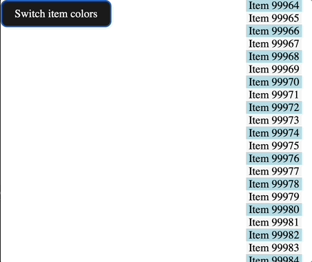
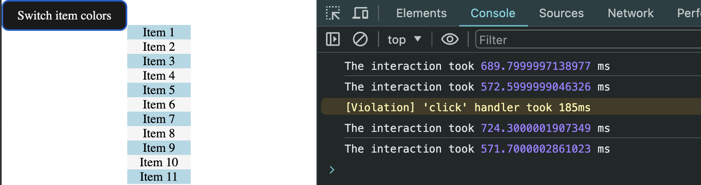
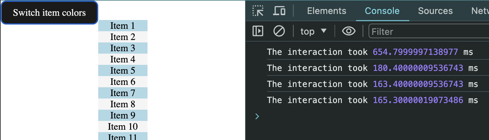

# ReactJS vs VanillaJS

**Objective**: demonstrate that ReactJS optimizes rendering speed compare to plain javascript (a.k.a Vanilla JS)

**Scenario**:

- render 100000 items in a simple list of `div` elements
- a button toggles the background color of each item



## Code structure

```sh
.
# ...
├── react
│   ├── README.md
│   ├── dist
│   ├── index.html
│   ├── node_modules
│   ├── package-lock.json
│   ├── package.json
│   ├── public
│   ├── src
│   └── vite.config.js
└── vanilla
    ├── app.css
    ├── index.html
    └── sort-data.js
```

There are two main folders:

- `react`: with react code bundle with vite. We deactivate minification to avoid biasing the benchmark.
- `vanilla`: plain javascript to be processed by the browser as is.

The only difference we want to measure is the **performance of the render function**.

For this reason, we are using exactly same functions to `switchItemsColor` and create the 100 000 data array of item once when the application is loading.

## Benchmark

To run the `vanilla` implementation:

```sh
nvm use
npm i
npm run vanilla
# should start a server listening on localhost:5174
```

To run the `react` implementation

```sh
nvm use
npm i
npm run react
# should start a server listening on localhost:5173

```

Toggle the inspector and look at console logs after clicking several time on the `Switch item colors` button.

You should see some outputs in the console like:

```plain
The interaction took 724.3000001907349 ms
The interaction took 571.7000002861023 ms
...
```

You should witness that React is roughly 3 times faster than the vanilla one.

## An example of benchmark result

To precisely only track performance of the re-rendering, we are using the [`afterFrame`](https://github.com/andrewiggins/afterframe) to have a simple method to invoke a function after the browser has rendered & painted a frame.

Here are example of results I can witness on google chrome on a Macbook Pro Apple M2:

- VanillaJS:
  
- ReactJS:
  

You notice that the first render is similar for both react and vanilla.
Then when iteracting several time, you see that ReactJS optimizes the rendering because items only changes their styles, so it doesn't delete/create nodes but only mutates its css.

See. [ReactJS reconciliation documentation](https://legacy.reactjs.org/docs/reconciliation.html#motivation) for more info about how ReactJS is able to optimize rendering.

You can see that react is faster roughly with a factor 3 over plain naïve javascript implementation.
